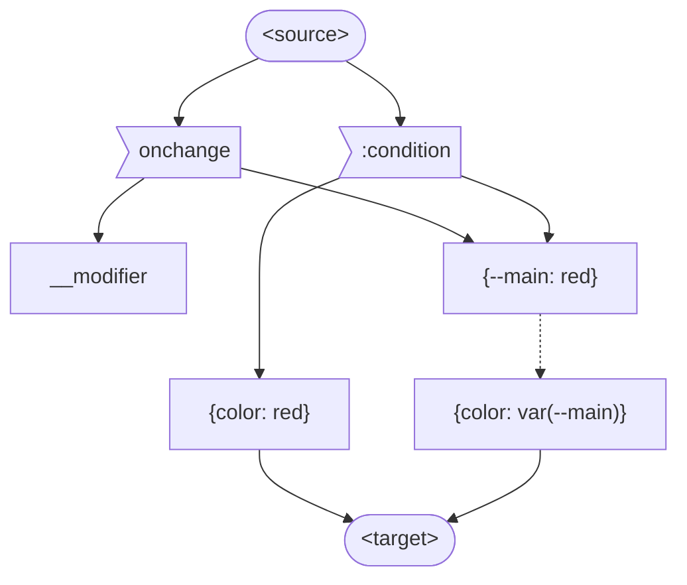

# DOM Stating

## General

`statement host { styles }`

Applying:

- CSS selector: `source:condition ~* target { body }` 
- BEM via JS: `target__modifier { body }`

Body: 

- CSS rules: `{ color: red }`
- CSS vars: `{ color: var(--color-main) }`

CSS:

considiton ~ * host { rules }

JS:

on(condition) => $$(host).classNames.switch(rulesId)

on(condition) => $$(host)

## Use cases

- Collapser/Expander/Toggler/Sort
- "Jumper"
- Tabs/Switcher
- Target
- Search
- Set Item's Title and Propagate

## MVC

## Reactive

- `var()` is observable
- Listener - any element
  - assigned to some host
  - Scope is inherited
- <Radio property value>:checked
  - --property: value
  - --property: --property-index