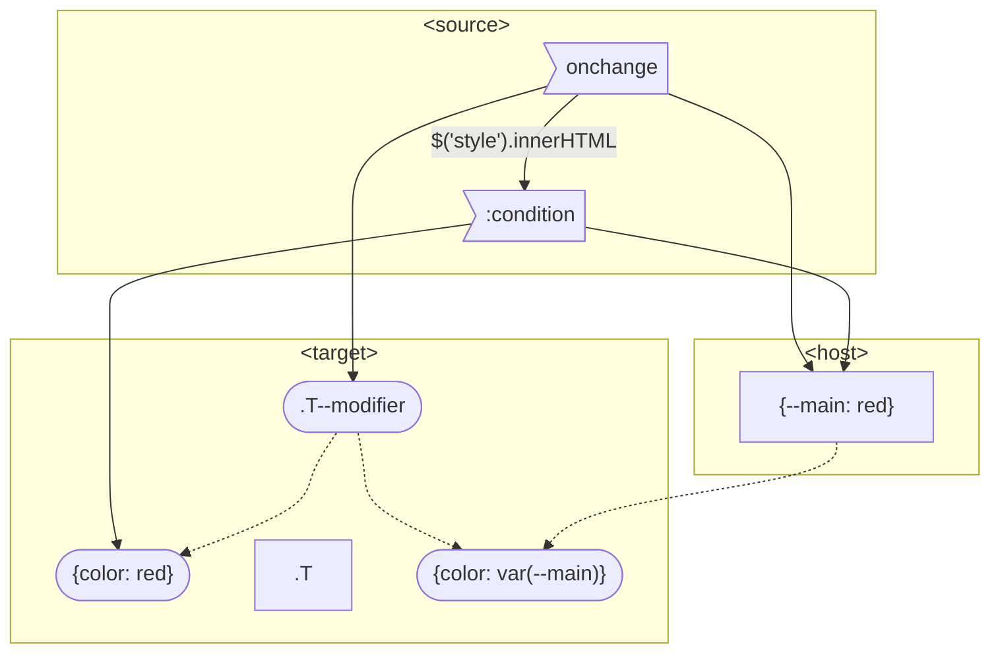

# DOM Stating

## General`

Applying:

- CSS selector: `Source:condition ~* Target { body }` 
- BEM: `Target--Modifier { body }`

Body: 

- CSS rules: `{ color: red }`
- CSS vars: `{ color: var(--color-main) }`

---

via JS:

- Query
  - BEM: `on(condition, () => $$(Target).classNames.toggle(Target--Modifier))`
  - `style` change: `on(condition, () => styleSheet.rules[X].selector = f(condition))`
- Body
  - `on(condition, () => $$(host).style[property /*var*/] = condition)`
  - `on(condition, () => $(style).rules[X][property] = f(condition))`

## Use cases

- Collapser/Expander/Toggler/Sort/ContextMenu
- "Jumper"
- Tabs/Switcher
- Target
- Search
- Set Item's Title and Propagate

## MVC

### Model

#### CSS

- `input:checked`
- `el:target, el:focus-within, el:hover, el:active`

#### JS

- `el.onevent = ({target: value, mouseX}) => next(value, {mouseX})`
- `new IntersectionObserver(ev => next(ev)).observe(el)`

### Queries

- `M ~* V, MV`
- `M ~* C`
- `V ~* C`

## Reactive

- `var()` is observable
- Listener - any element
  - assigned to some host
  - Scope is inherited
- Radio_property--value:checked
  - --property: value
  - --property: --property-index